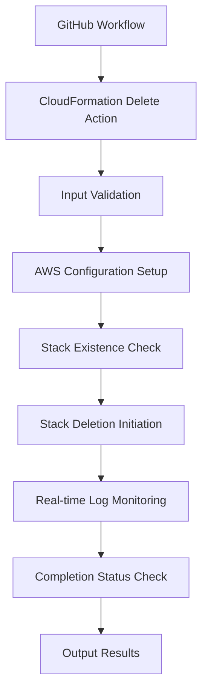

# Design Document

## Overview

The CloudFormation Stack Delete Action is a GitHub composite action that provides a reusable way to delete AWS CloudFormation stacks with real-time logging capabilities. The action will be implemented as a composite action using shell scripts and AWS CLI commands to interact with CloudFormation services.

## Architecture

The action follows GitHub Actions composite action architecture pattern:



### Key Components:
1. **Input Handler**: Validates and processes input parameters
2. **AWS Client**: Manages AWS CLI interactions and authentication
3. **Stack Manager**: Handles CloudFormation stack operations
4. **Log Monitor**: Provides real-time event streaming
5. **Error Handler**: Manages error scenarios and exit codes

## Components and Interfaces

### Action Inputs
```yaml
inputs:
  stack-name:
    description: 'Name of the CloudFormation stack to delete'
    required: true
  aws-region:
    description: 'AWS region where the stack is located'
    required: false
    default: 'us-east-1'
  wait-for-completion:
    description: 'Whether to wait for deletion to complete'
    required: false
    default: 'true'
```

### Action Outputs
```yaml
outputs:
  stack-status:
    description: 'Final status of the stack deletion operation'
  deletion-time:
    description: 'Time taken for the deletion process'
```

### Core Scripts Structure
```
scripts/
├── delete-stack.sh          # Main deletion orchestration
├── validate-inputs.sh       # Input validation logic
├── monitor-events.sh        # Real-time event monitoring
└── utils.sh                # Common utility functions
```

## Data Models

### Stack Information Model
```bash
# Stack state representation
STACK_NAME=""
STACK_STATUS=""
STACK_REGION=""
DELETION_START_TIME=""
LAST_EVENT_TIMESTAMP=""
```

### Event Model
```bash
# CloudFormation event structure
EVENT_TIMESTAMP=""
EVENT_STATUS=""
EVENT_RESOURCE_TYPE=""
EVENT_LOGICAL_ID=""
EVENT_STATUS_REASON=""
```

## Error Handling

### Error Categories and Responses

1. **Input Validation Errors**
   - Missing stack name: Exit code 1 with clear message
   - Invalid region format: Exit code 1 with validation message

2. **AWS Authentication Errors**
   - Missing credentials: Exit code 2 with authentication guidance
   - Insufficient permissions: Exit code 2 with permission details

3. **Stack Operation Errors**
   - Stack not found: Warning message, exit code 0 (success)
   - Stack in invalid state: Exit code 3 with state information
   - Deletion failed: Exit code 4 with CloudFormation error details

4. **Monitoring Errors**
   - API throttling: Implement exponential backoff
   - Network issues: Retry with timeout

### Error Handling Strategy
```bash
# Error handling pattern
handle_error() {
    local exit_code=$1
    local error_message=$2
    echo "::error::$error_message"
    exit $exit_code
}
```

## Testing Strategy

### Unit Testing Approach
1. **Input Validation Tests**
   - Test valid and invalid stack names
   - Test region parameter handling
   - Test required parameter validation

2. **AWS Integration Tests**
   - Mock AWS CLI responses for different scenarios
   - Test authentication error handling
   - Test stack state transitions

3. **Log Monitoring Tests**
   - Test event parsing and formatting
   - Test real-time display functionality
   - Test completion detection

### Integration Testing
1. **End-to-End Workflow Tests**
   - Create test stacks and verify deletion
   - Test with different stack states
   - Verify log output format and timing

2. **Error Scenario Tests**
   - Test non-existent stack handling
   - Test permission denied scenarios
   - Test network failure recovery

### Test Environment Setup
```yaml
# Test workflow example
test-stack-deletion:
  runs-on: ubuntu-latest
  steps:
    - uses: actions/checkout@v4
    - name: Test Stack Deletion
      uses: ./
      with:
        stack-name: test-stack-${{ github.run_id }}
        aws-region: us-east-1
```

## Implementation Details

### Real-time Logging Implementation
The action will use AWS CLI's `describe-stack-events` command with polling to provide real-time updates:

```bash
# Polling mechanism for real-time logs
monitor_stack_events() {
    local stack_name=$1
    local last_timestamp=""
    
    while true; do
        # Get latest events since last check
        aws cloudformation describe-stack-events \
            --stack-name "$stack_name" \
            --query "StackEvents[?Timestamp>'$last_timestamp']" \
            --output table
        
        # Update timestamp and check completion
        # Sleep and continue polling
    done
}
```

### Stack State Management
The action will handle various CloudFormation stack states:
- `DELETE_IN_PROGRESS`: Monitor existing deletion
- `DELETE_COMPLETE`: Already deleted (success)
- `DELETE_FAILED`: Handle failure scenarios
- Stack not found: Treat as success with warning

### Performance Considerations
- Implement exponential backoff for API calls
- Optimize polling frequency based on stack size
- Cache AWS CLI configuration to reduce setup time
- Use efficient event filtering to reduce API calls